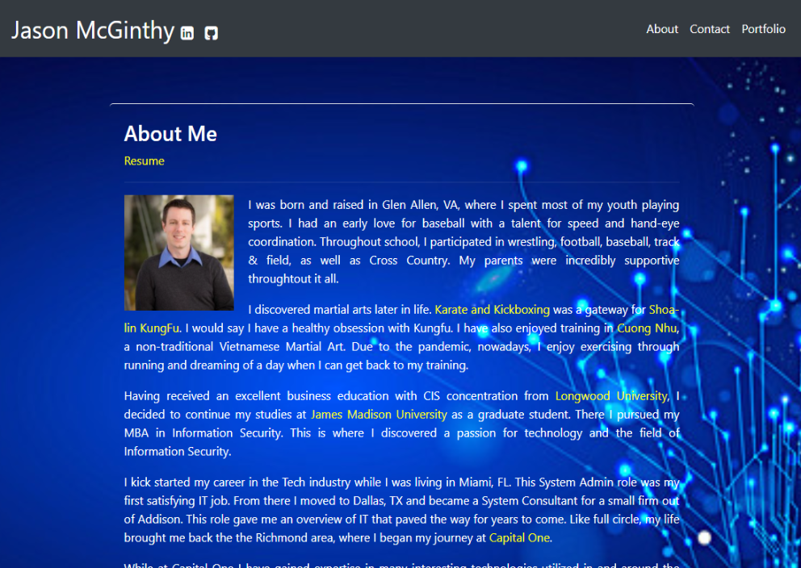

<!-- Repository should contain quality README file with description, screenshot, and link to deployed application. -->

# My Portfolio Site

Welcome to my Portfolio site! I am a Sr. Manager of Software Engineering at Capital One and a student of the University of Richmond's Full-Stack Software Engineering Bootcamp. 

## Description

This site is my first publicly accessible project. I created it to inform viewers some basic information about me, where to submit their contact information, and links to other projects I contributed to.

## Link to Site

https://github.com/codragon2020/codragon2020.github.io/index.html

## Screenshot

 

 
